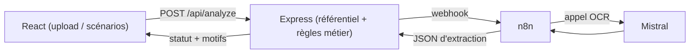

# Contrôle documentaire assisté par IA

Portfolio personnel démontrant un système de **gouvernance documentaire** : l'OCR (Mistral) extrait les données d'une pièce d'identité, un moteur de règles métier applique une décision explicable. L'extraction et la décision sont volontairement séparées: l'IA ne décide jamais seule.

Ce n'est pas une démo OCR. C'est une démonstration de séparation entre extraction IA et décision métier explicable.


## Démonstration

 

🔗 **Démo en ligne** : [\[(https://ocr-tests-frontend.onrender.com/)\]]

L'application est conçue pour se comprendre seule, en moins de deux minutes, sans lecture préalable : un bandeau d'introduction, un encart pédagogique propre à chaque scénario, et un accordéon "Comment ça marche ?" pour qui veut aller plus loin. Ce README complète la démo, il n'est pas nécessaire pour la comprendre.

## Le problème

L'OCR peut halluciner des valeurs plausibles mais fausses. Un score de confiance élevé ne garantit rien — deux constats issus de mes propres tests, confirmés par la littérature OCR/document-IA.

C'est pour cette raison que l'extraction n'est jamais prise pour argent comptant : un système qui déciderait sur la seule extraction, ou le seul score, finit tôt ou tard par valider un document faux avec assurance, ou rejeter un document valide sur un score non pertinent. Les données OCR ne remplacent donc jamais le référentiel — elles sont comparées à lui, jamais prises pour vraies par défaut.

La question posée ici : comment utiliser l'IA pour ce qu'elle fait bien — lire un document — sans jamais lui laisser la décision métier ?

## La solution

Une architecture à trois couches, avec une frontière stricte entre extraction et décision :



- **n8n** fait de l'extraction uniquement : reçoit le document, appelle Mistral OCR, normalise le JSON. Aucune règle métier, aucun accès au référentiel.
- **Express** détient le référentiel (données de référence) et le moteur de règles. Il compare l'extraction à la référence, produit un statut et la liste des motifs qui l'expliquent. Les règles sont testées (Jest), pas laissées à l'appréciation du modèle.
- **React** affiche l'extraction face à la référence, le statut, et l'explication — jamais un score brut présenté comme une décision.

### Statuts produits

| Statut | Signification |
|---|---|
| `VALIDE` | Identité conforme au référentiel, qualité documentaire suffisante — décision automatisée. |
| `A_VERIFIER` | Divergence mineure, champ manquant, ou qualité incertaine — contrôle humain requis. |
| `REJETE` | Divergence forte sur l'identité (nom, date de naissance) ou prénoms incompatibles. |
| `HORS_SUJET` | Aucune information exploitable extraite — le document ne semble pas être une pièce d'identité. |

Chaque statut est accompagné d'une liste de **motifs explicites** (ex. `IDENTITE_DIVERGENTE:nom`, `QUALITE_DOCUMENTAIRE_FAIBLE`), traduits en langage compréhensible dans l'interface — jamais une décision sans justification traçable.

## Essayer le projet

Le mode de démonstration principal est une série de **scénarios prédéfinis**, un bouton par cas métier. Chacun rejoue une vraie réponse Mistral, capturée une fois lors d'un test réel — aucun appel réseau au clic, donc pas de dépendance à une infrastructure externe pour la démo. Le moteur de règles, lui, s'exécute en direct sur cette donnée : ce qui est démontré (la décision et sa traçabilité) est intégralement réel.

- **Document conforme** → `VALIDE`
- **Champ obligatoire manquant** → `A_VERIFIER`
- **Qualité documentaire dégradée** (identité pourtant conforme) → `A_VERIFIER`
- **Divergence d'identité** → `REJETE`
- **Document hors sujet** → `HORS_SUJET`

Un formulaire d'upload libre reste disponible en secondaire, pour qui veut tester avec son propre document (spécimen fictif uniquement — des exemplaires sont fournis dans `frontend/public/specimens/`).

## Enseignements et limites

- **Extraction et décision doivent être strictement séparées.** L'IA lit, le code métier décide — cette frontière est ce qui rend le système auditable.
- **Un score de confiance OCR est un signal de qualité, jamais un critère de décision autonome.** Constat général du domaine, pas une limite propre à Mistral. Le scénario "qualité dégradée" le rend concret : une identité conforme peut tout de même déclencher un contrôle humain si la lecture est jugée incertaine.
- **L'absence de preuve n'est pas une preuve de problème.** Un champ manquant place le document en `A_VERIFIER`, pas en `REJETE` — le système ne suppose jamais la cause (mauvaise lecture ponctuelle vs document réellement incomplet), il transmet la décision à un humain plutôt que de deviner.
- **Toute décision doit rester traçable.** Chaque statut est justifié par des motifs explicites, pas par un score opaque.
- **`HORS_SUJET` est une simplification assumée du MVP.** Un système réel distinguerait "document hors périmètre" (facture, photo...) d'un "document inexploitable" (trop dégradé pour être lu) — je ne dispose pas aujourd'hui d'un signal fiable pour séparer proprement les deux, donc le MVP les regroupe sous un seul statut plutôt que de faire semblant de trancher.

## Stack technique

- **Frontend** : React + Vite
- **Backend** : Node.js + Express, tests unitaires Jest sur le moteur de règles
- **Automatisation OCR** : n8n + Mistral OCR

## Lancer le projet en local

Prérequis : Node.js 18+, une instance n8n avec le workflow d'extraction actif.

```bash
# Backend
cd backend
npm install
cp .env.example .env   # renseigner N8N_WEBHOOK_URL
npm run dev            # http://localhost:3001

# Frontend (autre terminal)
cd frontend
npm install
npm run dev             # http://localhost:5173
```

Lancer les tests du moteur de règles :

```bash
cd backend
npm test
```

## Pourquoi ce projet ?

Ce projet est né d'expérimentations menées autour du traitement automatisé de documents administratifs.

L'objectif n'était pas de construire un OCR supplémentaire, mais de comprendre comment intégrer une extraction IA dans un processus métier tout en conservant une décision explicable, traçable et auditables.

## Contraintes

- Uniquement des spécimens fictifs ou officiels de démonstration — jamais de vraie pièce d'identité (RGPD).
- Clés API et URL n8n dans un `.env` non commité.
